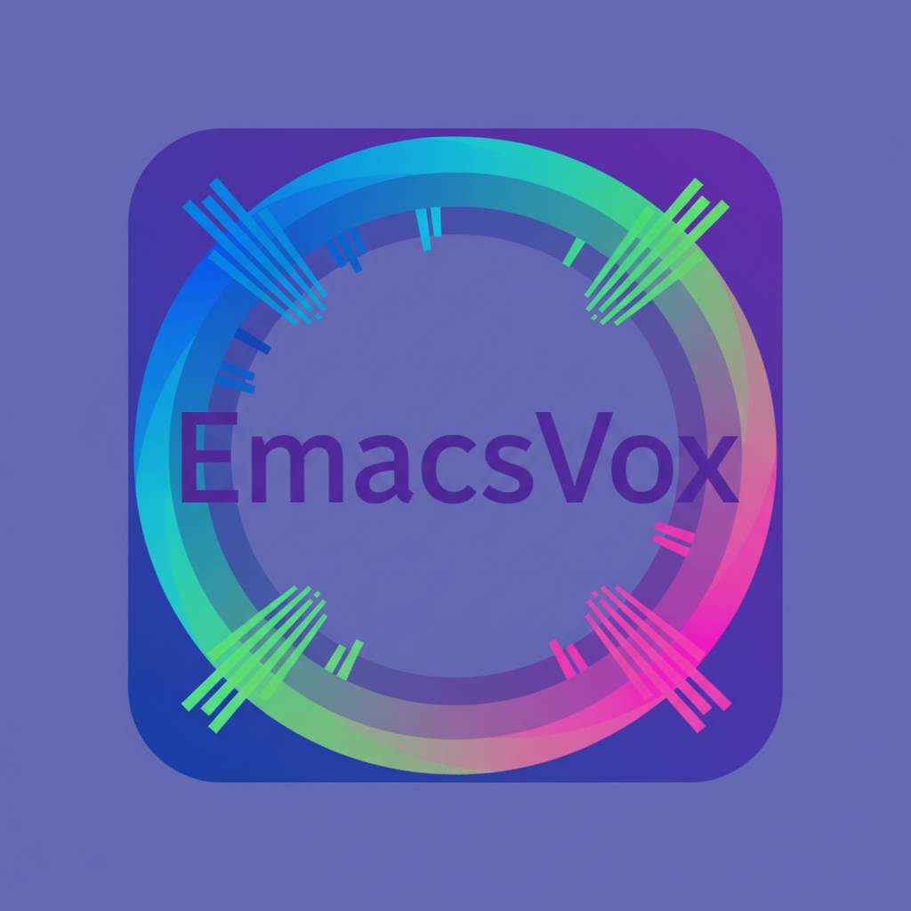

* Emacsvox

* Table of Contents
1. [[*Emacsvox][Emacsvox]]
2. [[*Description][Description]]
3. [[*Quick Installation Instructions][Quick Installation Instructions]]
4. [[*Aural Presentation Schemes][Aural Presentation Schemes]]
5. [[*Blog and Portfolio][Blog and Portfolio]]
6. [[*Additional Info][Additional Info]]

** Description
*Emacsvox* is a modernized fork of Emacspeak - a speech interface that helps visually impaired users work with the Emacs editor. Emacsvox turns Emacs into a complete audio desktop, giving audio feedback allowing full access to all of its features.

*Modernization Status:* Fully updated for Emacs 31+ with modern elisp patterns and advice-add throughout.

** TTS Namespace Upgrade

The generic speech interface now uses =tts-*= names and the
=TTS_PROGRAM= environment variable.  This is an intentional breaking change:
configuration written for the old generic =dtk-*= interface must be updated.
Names for actual DECtalk backends, such as =dtk-exp= and =dtk-soft=, are
unchanged.  See [[file:etc/tts-modernization.org][the migration record]] for
the complete naming policy and migration table.

** Emacsvox Namespace Upgrade

Active project configuration uses the Emacsvox name.  Set =EMACSVOX_DIR= when
a speech server or external utility needs the checkout root, and set
=EMACSVOX_PLAY= to override the audio player used by TTS servers.

The former =EMACSPEAK_DIR= and =EMACSPEAK_PLAY= environment variables are not
recognized.  This is an intentional breaking change; update user configuration
to the Emacsvox names.  References to Emacspeak remain where they identify the
upstream project, historical material, or the pinned comparison test checkout.

** Omnivox And Portable Logical Voices

Omnivox is the native Windows server that is being extended into Emacsvox's
multi-engine speech host.  Build and stage its content-addressed Windows
runtime from this checkout with:

#+BEGIN_SRC sh
make windows-omnivox
#+END_SRC

This builds the Windows executable, separate 32-bit Eloquence and DECtalk
capture helpers, and a native copy of the platform-neutral eSpeak voice data,
then stages them with the required MinGW runtime DLLs under
=servers/omnivox-bin=.
The voice data is required for the Windows eSpeak fallback to initialize.  The
Eloquence helper uses a user-installed 32-bit ECI runtime; no proprietary ECI
DLL is copied or distributed.  If the ignored local DECtalk runtime directory
already contains =DECtalk.dll= and =dtalk_us.dic=, the staging recipe copies
them into this machine's content-addressed runtime.  It does not download them;
run =make -C servers/windows-dectalk runtime= explicitly before rebuilding to
enable DECtalk.

Select it with =M-x omnivox=.  On startup the adapter negotiates the versioned
control protocol, discovers the live engine inventory, and atomically
registers Emacsvox's logical voices with both the main and notification
servers.  Older servers continue to use the legacy speech protocol.

On Windows, current Omnivox servers initialize both WinRT and eSpeak when they
are available.  When the staged helpers can load their runtimes, Eloquence's
=v1= through =v8= voices and DECtalk's named voices such as =paul= and =betty=
also appear in inventory for per-span logical routing.  A missing helper, DLL,
dictionary, or native voice degrades through the configured alternatives.
WinRT is the preferred engine by default;
=OMNIVOX_ENGINE=espeak= makes eSpeak preferred while retaining WinRT in the
inventory.  A logical voice without an explicit preference binds to the
preferred engine reported by each speech process.  Registration waits for that
process's inventory, so differing main, notification, or machine voice lists do
not need to be copied into portable Emacs configuration.
The WSL launcher forwards =OMNIVOX_ENGINE=, =OMNIVOX_AUDIO_TARGET=,
=OMNIVOX_ELOQUENCE_HELPER=, =OMNIVOX_ECI_DLL=,
=OMNIVOX_DECTALK_HELPER=, and =OMNIVOX_DECTALK_DLL= to the Windows process.
The last four are optional overrides; normally staged helper discovery and
each engine's standard runtime location need no configuration.

Portable preferences do not copy a machine's discovered voice list into user
configuration.  Instead, each logical voice has ordered exact, engine-default,
or property selectors that are resolved against the inventory of the machine
where Omnivox is running.

Use =M-x emacsvox-aural-voice-workbench=, or press =W= in Aural Home, to
configure these preferences without editing Lisp.  Its logical, physical,
engine, and style views use =l=, =v=, =e=, and =s=.  Use =F= to filter voice
traits or engine health, =C= to clear filters, and =R= to refresh inventory.
=P= previews one row, =A= previews all visible voices, =B= compares selected
voices, =T= changes the common sample text, =S= stops preview, and =t= opens
the route-aware tuner.  None of these saves configuration.  When the active
voice palette is built in, =t= offers to create and activate an editable
personal copy before tuning.  Use =a= to assign an installed voice and =j= to
review a portable route suggestion.  Exact native IDs are machine-local;
language, gender, and engine default selectors re-resolve on each machine.
The tuner's Relative Rate is a signed direct-point offset from the current
global zero-to-100 rate: at 75, =-1= speaks at 74 and =+4= at 79.  Zero or an
unset value means unchanged.  Omnivox applies it after route selection, so the
same effective normalized rate reaches WinRT, Eloquence, DECtalk, or eSpeak.
An older server or an engine without rate support keeps the palette setting
but reports it as omitted.  Legacy palette =:rate 0= is safely neutral;
nonzero legacy absolute values are ignored and identified for retuning.
Use =m= to stage migration from existing Omnivox settings or the current
palette, =N= for routing presets, and =E= or =I= to exchange one data-only
profile.  No inferred route is saved without review.

Use =w= or =C-c C-c= to atomically write and apply the complete profile to every
live speech stream.  The voice tuner uses the same keys to write one edited
style and return.  A partial apply remains visible and can be retried with =r=;
=U= restores the previous saved revision.  Rows distinguish predicted,
registered, and last actually played routes and report fallback or omitted
dimensions.  Standalone Eloquence/Outloud and DECtalk adapters consume the
same profile through their static voice-family descriptions.

The following variables remain an advanced compatibility and migration input.
For example:

#+BEGIN_SRC elisp
(setq omnivox-logical-voice-preferences
      '((voice-annotate
         (exact "dectalk" "paul")
         (exact "eloquence" "v1")
         (engine-default "winrt"))
        (voice-monotone
         (properties :language "en-US" :gender male))))

(setq omnivox-fallback-engine-ids '("espeak"))
#+END_SRC

An exact selector always keeps the engine ID and native voice ID separate.
Missing engines and voices fall through the configured alternatives; property
selectors late-bind without requiring identical voice catalogues on every
computer.  Valid definitions that cannot currently resolve remain registered
with diagnostic attempts instead of being discarded.

Preference keys may be either generated ACSS voice IDs or semantic Emacs voice
symbols such as =voice-bolden=.  Emacsvox follows the semantic symbol's current
single-step voice binding when it builds the Omnivox registry, so a preference
for =voice-bolden= applies to the generated voice that actually appears in
speech output.

After changing these variables directly, open the Voice Workbench and use =m=
to import, review, and then =w= to save and apply them.  The low-level
=M-x omnivox-register-logical-voices= command remains available for diagnostic
experiments.  The latest structured results are in
=omnivox-control-capabilities=, =omnivox-engine-inventory=,
=omnivox-logical-voice-registration=, and =omnivox-control-last-error=.

Each Omnivox voice code now includes its stable logical voice ID.  Servers that
advertise =logical_voice_routing= use the registered binding to select the
engine and physical voice for following queued speech spans.  Bindings are
snapshotted at dispatch, so later registration changes affect later batches.
Missing or unresolved routes fall back to the process's preferred legacy
engine; older servers ignore the routing directive and continue to honor the
existing pitch code.

Servers that also advertise =emacsvox_tx= receive each replaceable aural
presentation as one bounded, generation-numbered UTF-8 frame.  Omnivox
validates the whole presentation before executing it, coalesces consecutive
frames to the newest generation, rejects stale frames, and keeps stop outside
the frame as a barrier.  Emacsvox automatically retains ordinary legacy
delivery when the capability is absent.

Servers advertising =playback_marker_events_v1= also enable
=tts-speak-marked=.  It accepts one callback for playback events and one for
the terminal status:

#+BEGIN_SRC elisp
(tts-speak-marked
 "hello from Omnivox"
 (lambda (dispatch-id event)
   (push (list dispatch-id event) my-marker-events))
 (lambda (dispatch-id status)
   (setq my-marker-terminal (list dispatch-id status))))
#+END_SRC

The first event for each nonempty synthesized chunk is an
=utterance_started= plist containing its exact processed text and realized
engine, physical voice, and logical voice.  Engines with native synchronization
support then produce =marker_reached= events for word, sentence, phoneme, or
native-index boundaries.  Event offsets have already followed resampling and
silence trimming.  They track mixer source consumption and can lead acoustic
output by device-buffer latency.  Stop and process retirement discard
unreached events and retire both callbacks.  Older servers reject
=tts-speak-marked= before text is submitted and continue using ordinary or
tracked speech unchanged.

For queued logical voices, current Omnivox servers re-resolve a missing voice
or failed engine against the dispatched registry snapshot and retry the same
text chunk on the selected fallback.  Retries are limited to four total
attempts and check stop generations before and after each engine call.  The
failure exclusion is local to that batch; persistent health/recovery and
immediate =tts_say= or letter routing remain planned.

** Aural Presentation

Emacsvox can present registered meaning with speech, voices, auditory cues,
pauses, and stereo placement.  A fixed internal =default= baseline preserves
existing output.  Users compose Presentation Options above it and can override
presentation globally or for a module, major mode, derived mode, session, or
individual buffer.

Point feedback on spoken lines is now modality-selectable.  Enable it with
=M-x emacsvox-toggle-show-point=, then use
=M-x emacsvox-set-show-point-presentation= to choose an animated voice, a
30-millisecond micro-tone, an earcon, voice plus tone or earcon, the spoken
word “point”, personal aural rules, or no presentation.  The selector changes
the current buffer and previews its line; use a prefix argument to also change
the global default.  Customize =emacsvox-show-point-presentation= to save the
choice.  Tone, earcon, and speech markers occur at the exact boundary before
the character under point, or after the final character at end of line.  They
are omitted on empty, whitespace-only, decorative, and otherwise unspeakable
lines, whose existing line-condition feedback is already sufficient.
The =custom= choice publishes =point-located=, =point-position=,
=point-boundary=, and =point-presentation= facts without imposing built-in
output, so personal rules can choose another sound, voice, pause, or spatial
style.  Point actions in personal rules should use =:anchor run= to stay at
the marked text boundary.  The existing =emacsvox-show-point= option remains
the master switch.

Capitalization and indentation use the same master-switch-plus-presentation
model.  =C-e d c= toggles capitalization indication and =C-e d C= selects
=spoken=, =tone=, =spoken-tone=, =custom=, or =none=.  The selected aural
presentation applies to capitalized boundaries and all-caps runs in queued
speech without inserting the words “cap” into the source text.  A current
Omnivox server also applies it to isolated letters; older speech servers retain
their existing isolated-letter behavior.

=C-e d i= toggles indentation indication and =C-e d I= selects spoken column,
fixed-pitch duration-coded tone, fixed-duration rising-pitch tone, either tone
combined with speech, =custom=, or =none=.  Rising pitch starts at
=emacsvox-indentation-pitch-tone-base=, rises by the configured semitones per
column, and is capped at =emacsvox-indentation-pitch-tone-maximum=.  Its
duration is never shorter than the registered blank-line tone.  Both selector
commands change the current buffer and preview the result; use =C-u= to also
change the global default.  The =custom= choices publish semantic facts for
personal Aural Presentation rules without imposing built-in output.

The compatibility baseline is an implementation layer, not a user-selectable
configuration.  Mode compatibility is supplied separately and automatically.
Ordered Presentation Options compose above those defaults, and personal,
session, and buffer overrides are the strongest layers.  Presentation Profiles
save complete named choices of options, sound pack, voice palette, and spatial
settings without copying rules.

The profile manager reports the selected profile as =active= while its saved
values match the live configuration and =diverged= when they differ.  Diverged
is not an unsaved-edit indicator: press =w= to write the current live values
into the profile, or =a= to restore the saved profile values.  Restoring asks
for confirmation before replacing live differences.

Use =M-x emacsvox-aural=, or =C-e H=, to open the spoken aural home.  It
reports current status and routes to saved profiles, presentation options,
recent exact feedback, buffer-local rules, semantic vocabulary,
sound packs, spatial controls, training, and the Aural Doctor.  Press =H= in
Aural Home, or run =M-x emacsvox-aural-list-recent-feedback=, to browse,
explain, replay, audition, or remap one of the retained presentations.  From
an ordinary buffer, =C-e E= always runs
=emacsvox-aural-explain-presentation= at point so presentation problems can
be inspected directly.  In Aural Home, =r= prepares a voice remap and =R=
auditions and remaps one exact before or after earcon.  The same keys work on
a selected recent-feedback record.  Press =h= in any aural manager or editor
to return home.  Aural-interface feedback is excluded from history by
default; press =i= in the recent-feedback browser to include it temporarily
for diagnosis.  Press =L= there to set any nonnegative history limit for the
current session, or customize
=emacsvox-aural-presentation-history-limit= to persist it.

Press =O= in Aural Home, or run
=M-x emacsvox-aural-list-overrides=, to manage persistent personal,
temporary session, and current-buffer rules in one spoken table.  It reports
what each rule targets, what it changes, whether it is enabled, and whether it
matches the remembered source item.  Editing preserves the selected rule;
preview resolves the complete current cascade; disabling or removing a rule
restores the next weaker behavior.

Use =M-x emacsvox-aural-list-profiles= to save and switch complete named
configurations over Emacsvox's fixed internal baseline.  A profile selects
ordered feature fragments and can capture sound-pack, voice-palette, and
portable spatial settings without copying their rules.  Buffer-local Voice
Lock remains independent of profiles.  Use =M-x emacsvox-aural-doctor= when
bindings, loaded byte-code, personal data, resources, or the backend appear
wrong; it reports each check and offers only explicit safe repairs.

The generated
[[file:etc/aural-presentation-reference.org][Aural Presentation Reference]]
documents user controls, presentation-option and module authoring, registered
semantics, sound packs, voice palettes, migration, queue ordering, and spatial
fallback.

Presentation rules can also target a named visual face as an explicit compatibility
fallback.  A face presentation may append an icon before or after the text and
select a palette voice, with the usual module, mode, occasion, session, and
buffer scopes.  Layered faces compose their actions; the strongest face wins
otherwise tied voice settings.  Prefer registered meaning when a semantic
role is available.

Personal sound packs are dynamic.  Put one immediate directory below
=sounds/= with at least =button.ogg=, then use
=M-x emacsvox-aural-list-sound-packs= to inspect, audition, validate, and
activate it.  =RET= opens its cue browser, which reports each cue's intent and
whether its file is native, inherited, resolved through fallback, or missing.
Discovered personal packs can edit summary, parent, coverage, and spatial
metadata with =e=.  Partial packs inherit through a safely written data-only
=emacsvox-sound-pack.el= manifest.

Agent Shell and Markdown are complete reference integrations.  Agent
transcripts expose session lifecycle, response, thought, plan, tool,
permission, source-block, table, viewport, and prompt-editor intent.
Markdown exposes headings, task state, lists, links, code blocks, tables,
footnotes, separators, visibility, and document operations, with the same
heading intent whether movement is by line or structural command.

Org exposes heading, content, list, paragraph, agenda, table, capture,
source-edit, and export intent.  Its =org-action= attribute distinguishes
navigation and lifecycle operations without hard-coding their presentation.
Notmuch, Gnus, Dired, and Magit also place all retained compatibility cues
inside semantic presentation boundaries.  The repository audit treats these
seven modules as migrated and rejects a new context-free direct icon call.

** Quick Installation Instructions

For a more detailed installation guide, and further instructions on usage, see the documentation. For a quick installation guide, see below.

1. Obtain the Source Code:
   - Clone the repository:
   #+BEGIN_SRC sh
   git clone https://github.com/robertmeta/emacsvox
   #+END_SRC

2. Change to the Emacsvox Directory:
   #+BEGIN_SRC sh
   cd emacsvox
   #+END_SRC

3. Configure the Sources:
   #+BEGIN_SRC sh
   make config
   #+END_SRC

4. Compile the Files:
   #+BEGIN_SRC sh
   make
   #+END_SRC

5. Install a Text-to-Speech Engine:
   - Open Source ESpeak on Linux:
     1. Install the ESpeak packages for your system.
     2. Compile the Emacsvox ESpeak server:
        #+BEGIN_SRC sh
        cd servers/native-espeak
        make
        #+END_SRC
   - ViaVoice Outloud (AKA Eloquent):
     - Purchase this engine from the Voxin site. See [[https://voxin.oralux.net/rss.xml][Voxin Packages]] for the latest packages and [[https://voxin.oralux.net][Voxin Main Site]] for more information.
   - Mac:
     - You can use the built-in Mac TTS engine. Emacsvox includes a speech server for this purpose.

6. Set Up the TTS Engine:
   After installing TTS engine, set up Emacsvox by adding the following line to your shell's configuration file:

   - For Bash (default on Linux or macOS before Catalina):
     Add the following line to your `.bash_profile`:
     #+BEGIN_SRC sh
     export TTS_PROGRAM=<engine-name>
     #+END_SRC

   - For Zsh (default on macOS Catalina and later):
     Add the following line to your `.zshrc` file:
     #+BEGIN_SRC sh
     export TTS_PROGRAM=<engine-name>
     #+END_SRC

   For example, to use ESpeak, add:
   #+BEGIN_SRC sh
   export TTS_PROGRAM=espeak
   #+END_SRC

7. Load Emacsvox in Your Emacs Configuration:
   Add the following line to the top of your .emacs file:
   #+BEGIN_SRC elisp
   (load-file "<emacsvox-dir>/lisp/emacsvox-setup.el")
   #+END_SRC
   Replace <emacsvox-dir> with the directory where you unpacked the sources.
   In a changing source checkout, rebuild with =make config && make= and keep
   this explicit =load-file= form.  It lets the setup entry point warn and
   prefer source if newer Lisp would otherwise be hidden by stale byte-code.
   A stable installed build may instead use =(load-library
   "emacsvox-setup")=.  See [[file:etc/install.org][the installation guide]]
   for the source-checkout and installed-package details.

** Requirements

*Emacsvox requires Emacs 31 or later.*

** Blog and Portfolio
  - [[https://emacspeak.blogspot.com][Original Emacspeak blog]]
  - [[https://tvraman.github.io][T. V. Raman]]

** Additional Info

Emacsvox is a fork of Emacspeak, modernized for Emacs 31+ with:
- All deprecated defadvice converted to advice-add
- Modern elisp patterns throughout
- Consistent code formatting
- Full Emacs 31+ compliance
